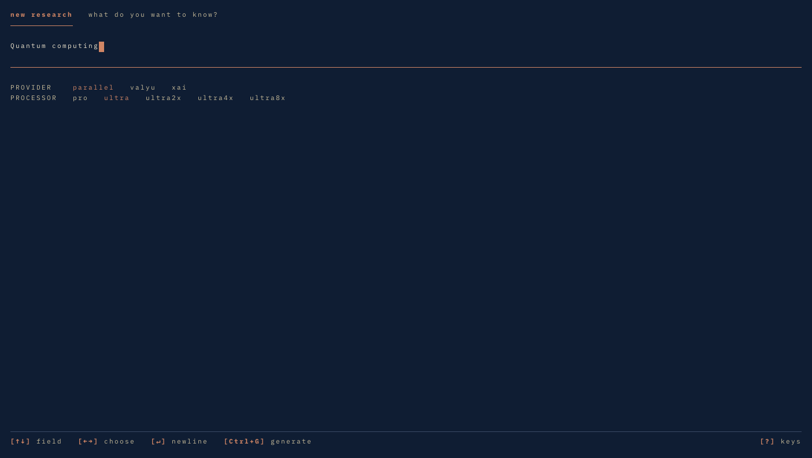
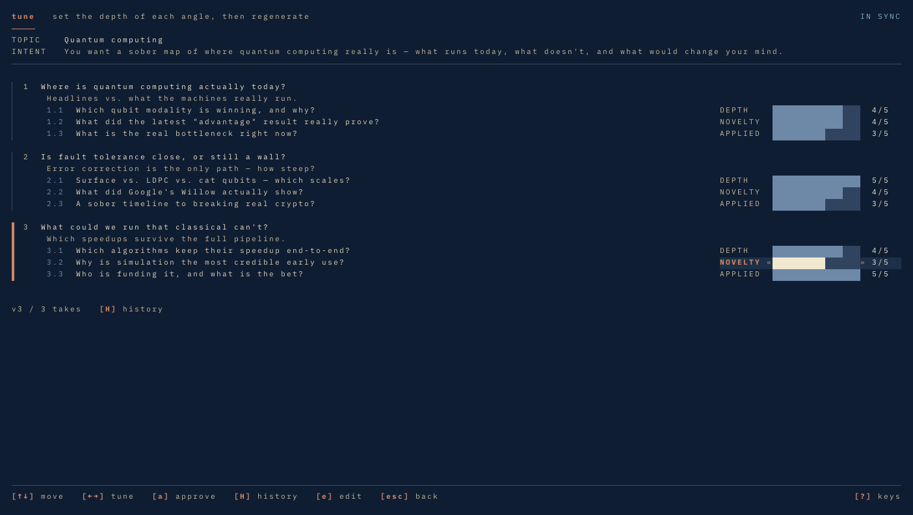
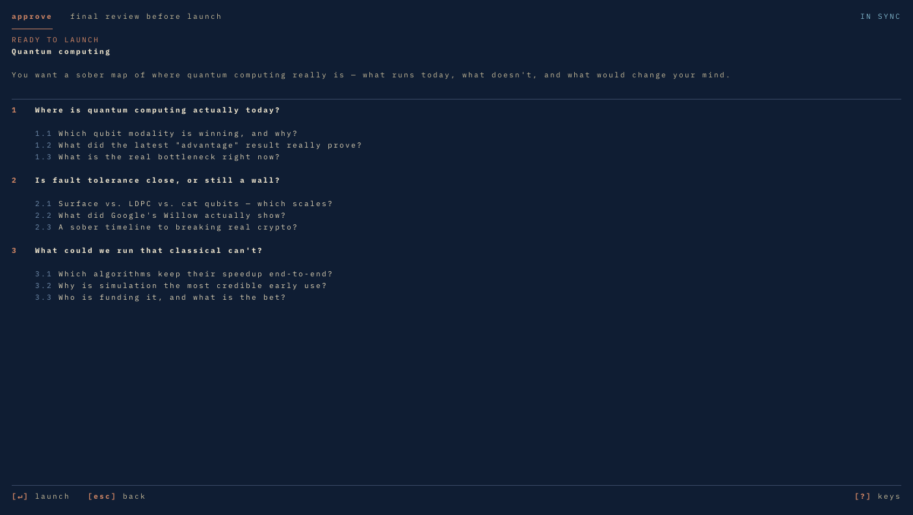

# fn research

Every deep research tool works the same way: you type a topic, it searches, you get 30 pages of vaguely relevant text. Nobody asked what you actually wanted to know.

This tool builds a research brief *with you* before searching anything.

## How the brief works

You type a topic and the TUI builds a structured brief in two phases — root topics, then sub-topics — with you in the loop.

**Phase 1** — the TUI generates 3 root topics from your request in a single Gemini call. Each one is a specific investigative angle, not a generic heading. Each comes with three properties — depth, novelty, applied — on a 1–5 scale. These aren't just labels: you can change them. Press `space` on a focused property to cycle its value, or press `e` to rewrite the topic text directly.

The TUI also writes a summary of how it understood your intent — "I think you want X because Y, I'm assuming Z about your context, I'm leaving W out of scope." If it got you wrong, edit and re-run.

**Phase 2** — 3 sub-topics per root topic. Same interactive refinement. You adjust, the brief updates.

The final brief is a tight 3×3 structure that goes to the research engine. Properties and reasoning get stripped — the engine sees only focused, self-contained research questions. But you saw the full reasoning before approving.

The difference: instead of searching "quantum computing" and hoping for the best, you're sending a brief that says exactly which 9 angles to investigate and at what depth.

## Quick start

```bash
cargo run --release        # launches the TUI
cargo run -- --mock        # demo mode — no API keys needed
```





When you press `↵` on the approve screen, the TUI spawns the research run as a detached background process and shows a confirmation card with the session id, output directory, and log file. You can quit the TUI immediately — the run keeps going.

## TUI hotkeys

| Key | Action |
|---|---|
| `↑↓` / `j k` | move between the nine knobs · input fields · history takes |
| `←→` / `h l` | adjust the focused knob · choose a provider/processor |
| `Ctrl+G` | generate the brief · regenerate after you tune |
| `a` | approve the take (when in sync) |
| `e` | edit the focused angle title |
| `u` | revert pending knob edits |
| `H` | browse take history (fork-preserving rollback) |
| `↵` | new line in the input · restore in history |
| `esc` | back / cancel |
| `F1` `F2` | sessions · keys |
| `?` | toggle help overlay |
| `Ctrl-C` | quit |

## The output

The PDFs have a Hokusai woodblock print vibe — generated covers, muted colors, wave motifs. Inside it's clean: good typography, table of contents, styled citations.

Both engines researching "AI transformation of academic research":
- [Parallel example](./examples/parallel-ai-academic-research.pdf) — 21 pages, strategic focus
- [Valyu example](./examples/valyu-ai-academic-research.pdf) — 25 pages, data-rich

## Providers

| | Parallel | Valyu | XAI |
|---|----------|-------|-----|
| **Sources** | Open internet | Open internet + academic & proprietary | Web + X/social |
| **Strength** | Strategic synthesis | Data-rich analysis, better citations | Social signals and discourse |
| **Best for** | Business decisions, implementation planning | Academic research, evidence gathering | Social coverage, trending topics |
| **Processors** | pro, ultra, ultra2x, ultra4x, ultra8x | fast, standard, heavy | social, full |
| **Speed** | 10–40 min | 30–90 min | 5–20 min |

## Setup

### Requirements

- Rust toolchain (stable). `cargo build --release` produces a single binary called `research`.
- A terminal with truecolor support (any modern terminal: iTerm2, Alacritty, kitty, Wezterm, Windows Terminal).
- Docker — only required to actually run a research session (the headless `research run` step uses WeasyPrint via Python). The TUI itself runs natively.

### Environment variables

```bash
export PARALLEL_API_KEY="..."   # Parallel AI access
export VALYU_API_KEY="..."      # Valyu access
export XAI_API_KEY="..."        # XAI access
export GEMINI_API_KEY="..."     # Brief generation + cover image
export REPORT_FOR="..."         # Optional: name in report attribution
```

The TUI reads them once at startup. Press `F2` to see which keys are set.

### Headless mode

The same binary runs research without the TUI:

```bash
research run "<topic>" "<brief>" --provider parallel --processor ultra --language English
research list
research generate <session-id>
research show <session-id>
```

This is the path the Docker entrypoint uses, and it's how the TUI's detached spawn launches each run.

## License

Apache 2.0. IBM Plex Mono and DejaVu Sans Mono are vendored under their respective open-font licenses (see `crates/research-tui/assets/`).
